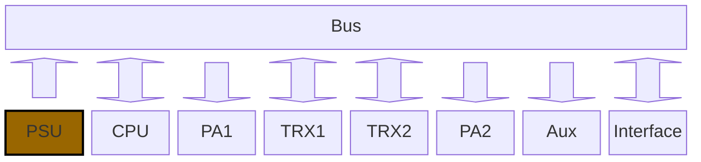

# PSU - Power Supply Unit

Die PSU versorgt die einzelnen Module mit verschiedene Spannungen.

Es werden folgenden Spannungen an den Bus weiter gegeben:
- Spannung vom Eingang (max. ~13.7V),
- 12V und
- 5V.

Aktuelle Leistungen können noch nicht bekannt gegeben werden da der Verbrauch auch noch nicht berechnet worden ist.

Als Spannungsquelle wird gerade an 13.7V (typische Autobatterie) oder 12V gedacht welche auch direkt an den Bus weiter geleitet wird für die PA.

# PSU mit Solar und Battery

Zur PSU welche einen einfachen Eingang besitzt, wäre auch eine PSU mit Solar und Batterie Eingang möglich.
