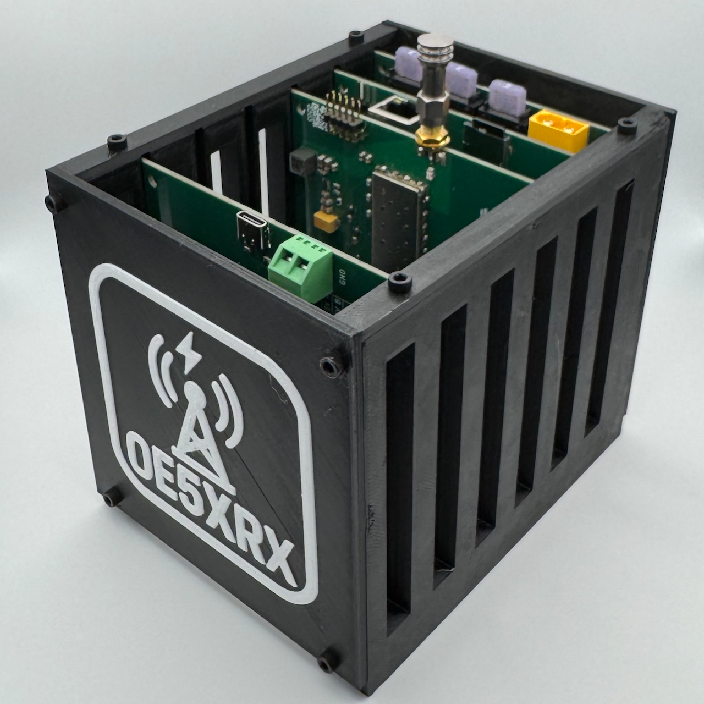
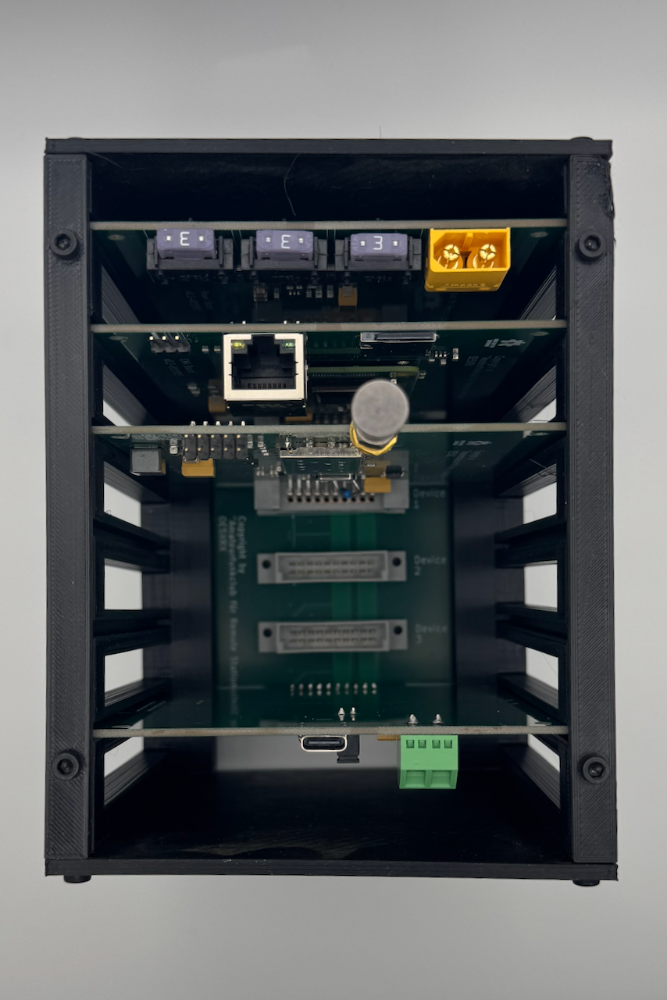
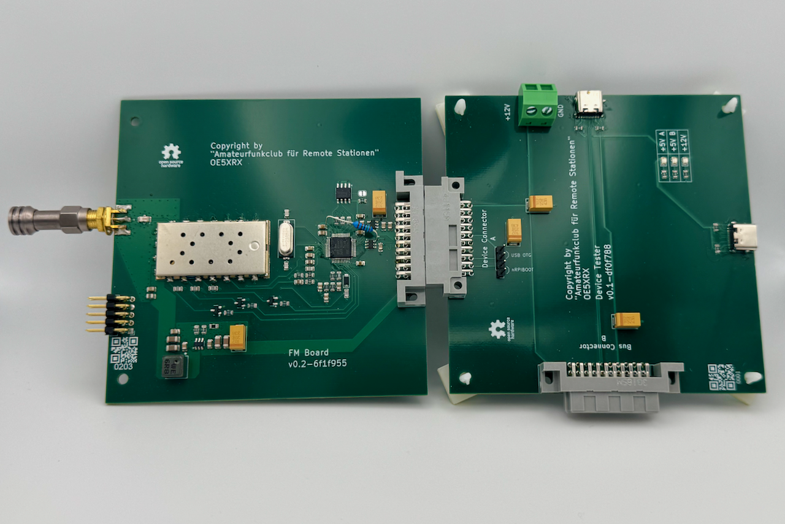
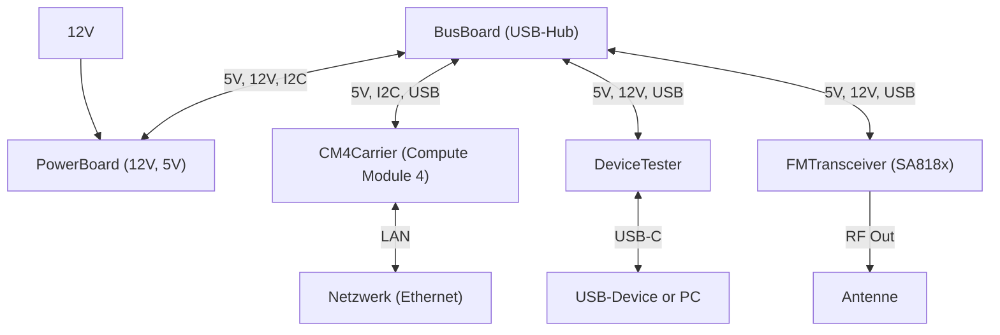

# OE5XRX Remote-Station – Struktur, Aufbau und aktueller Entwicklungsstand

Im QSP 04/2025 wurde erstmals über den neu gegründeten Amateurfunkclub **OE5XRX** berichtet, dessen Ziel es ist, eine modulare Remote-Station für den Amateurfunk zu entwickeln, aufzubauen und in Österreich zu betreiben.  
Seither ist viel passiert: Nicht nur die grundlegende Architektur wurde definiert, auch die ersten Hardware-Revisionen sind fertiggestellt, getestet und bereits beim **DX-Camp in Döbriach** vorgestellt worden.  
Dieser Artikel gibt einen Überblick über den **Aufbau der Station** und den **aktuellen Stand der Entwicklung**.

---

## Struktur und Aufbau

Die Remote-Station folgt einem **modularen Konzept**, das sich an klassischen Backplane-Systemen orientiert.  
Eine zentrale **BusBoard-Platine** bildet dabei das Rückgrat: Sie übernimmt die mechanische und elektrische Verbindung zwischen allen Modulen und erlaubt so eine flexible Erweiterung.

Darauf aufbauend sind spezialisierte Funktionsmodule vorgesehen:

- **CM4Carrier:** Nimmt ein Raspberry Pi Compute Module 4 auf, das als zentrale Steuer- und Netzwerk-Einheit dient. Über LAN, USB und I²C werden die angeschlossenen Module verwaltet.  
- **PowerBoard:** Versorgt die gesamte Station mit geregelten Spannungen (z. B. 12 V, 5 V) und überwacht Strom und Spannung.  
- **DeviceTester:** Dient als flexibles Interface, um Peripherie und Endgeräte vor deren dauerhafter Integration zu prüfen.  
- **FMTransceiver:** Neu hinzugekommen und erstmals mit einem STM32-Mikrocontroller ausgestattet. Sie bindet ein SA818-Modul ein und ermöglicht FM-Betrieb auf VHF oder UHF.  

Zukünftig sind weitere Module in Planung, etwa **Antennenschalter**, **HF-Endstufen** oder **Sensor- und Überwachungskarten**, die Temperatur, Strom oder SWR messen können.  
Diese klare Trennung in Infrastruktur (BusBoard, CM4Carrier) und Funktion (Module) erlaubt eine einfache Wartung und hohe Flexibilität – zentrale Faktoren für eine langlebige Remote-Station.

Alle Schaltpläne, Layouts und Platinenentwürfe sind auf der Projektseite frei zugänglich dokumentiert:  
👉 [https://oe5xrx.org/docs/remote-station/hardware/](https://oe5xrx.org/docs/remote-station/hardware/)

---

## Aktueller Stand

Nach Fertigstellung der ersten Hardware-Generation (**Version 0.1**) und den dabei gewonnenen Erfahrungen wurde schnell eine verbesserte **Version 0.2** entwickelt.  
Alle fünf Module – *BusBoard, CM4Carrier, PowerBoard, DeviceTester sowie das neue FMTransceiver-Modul* – wurden inzwischen gefertigt, bestückt und erfolgreich getestet. Damit steht erstmals ein vollständiger und funktionsfähiger Hardware-Satz zur Verfügung.

Besondere Bedeutung hat das **FMTransceiver-Modul**, da es mit dem STM32-Mikrocontroller nicht nur neue Hardware, sondern auch eine eigenständige Firmware erfordert.  
Dafür wurde ein **Firmware-Projekt** aufgesetzt, das ebenfalls modular strukturiert ist.  
Die Software soll mit **Unit-Tests** und **Host-Debugging** entwickelt werden, um eine saubere und nachhaltige Code-Basis zu schaffen.  
Ziel ist es, künftige Module ebenfalls unkompliziert softwareseitig einzubinden und den Betrieb der Remote-Station langfristig stabil zu halten.

Ein wichtiger Meilenstein war die Präsentation beim **DX-Camp in Döbriach**.  
Dort konnten die funktionierenden Platinen erstmals einem breiteren Publikum gezeigt werden.  
In Gesprächen mit anderen Funkamateuren ergaben sich wertvolle Impulse und die Aussicht auf mögliche **Kooperationen**, die das Projekt in Zukunft bereichern könnten.

---

## Ausblick

Mit der funktionierenden Version 0.2 und den ersten Schritten im Firmware-Bereich ist die Remote-Station nun in einer Phase angekommen, in der **Hardware und Software Hand in Hand entwickelt werden**.  
Die kommenden Monate werden zeigen, wie sich das Zusammenspiel bewährt und welche Erweiterungen als Nächstes folgen.

Das Ziel bleibt klar:  
Eine robuste, modulare und offen dokumentierte Remote-Station, die in Österreich aufgebaut und von Funkamateuren genutzt werden kann.  
Interessierte sind eingeladen, sich auf der Projektseite zu informieren und einzubringen:  
👉 [https://oe5xrx.org](https://oe5xrx.org)

---

## Abbildungen

  
*Abb. 1: Die bestückten Platinen der Remote-Station in Version 0.2 – BusBoard, CM4Carrier, PowerBoard, DeviceTester und das neue FMTransceiver-Modul in einem 3D gedrucktem Gehäuse.*

  
*Abb. 1: Die bestückten Platinen der Remote-Station in Version 0.2 – BusBoard, CM4Carrier, PowerBoard, DeviceTester und das neue FMTransceiver-Modul in einem 3D gedrucktem Gehäuse.*

*Abb. 2: Das FMTransceiver-Modul wird über das DeviceTester-Modul programmiert und getestet.*

*Abb. 2: Blockdiagramm der aktuellen Struktur mit Bus und Modulen.*
