# OE5XRX Remote-Station – Struktur, Aufbau und aktueller Entwicklungsstand

Im QSP 04/2025 wurde erstmals über den neu gegründeten Amateurfunkclub **OE5XRX** berichtet, dessen Ziel es ist, eine modulare Remote-Station für den Amateurfunk zu entwickeln, aufzubauen und in Österreich zu betreiben.  
Seither ist viel passiert: Nicht nur die grundlegende Architektur wurde definiert, auch die ersten Hardware-Revisionen sind fertiggestellt, getestet und bereits beim **DX-Camp in Döbriach** vorgestellt worden.  
Dieser Artikel gibt einen Überblick über den **Aufbau der Station** und den **aktuellen Stand der Entwicklung**.

---

## Struktur und Aufbau

Die Remote-Station folgt einem **modularen Konzept**, das sich an klassischen Backplane-Systemen orientiert.  
Eine zentrale **Bus-Platine** bildet dabei das Rückgrat: Sie übernimmt die mechanische und elektrische Verbindung zwischen allen Modulen und erlaubt so eine flexible Erweiterung.

Darauf aufbauend sind spezialisierte Funktionsmodule vorgesehen:

- **CM4-Platine:** Nimmt ein Raspberry Pi Compute Module 4 auf, das als zentrale Steuer- und Netzwerk-Einheit dient. Über LAN, USB und I²C werden die angeschlossenen Module verwaltet.  
- **Power-Platine:** Versorgt die gesamte Station mit geregelten Spannungen (z. B. 12 V, 5 V) und überwacht Strom und Spannung.  
- **Device-Tester-Platine:** Dient als flexibles Interface, um Peripherie und Endgeräte vor deren dauerhafter Integration zu prüfen.  
- **FM-Platine:** Neu hinzugekommen und erstmals mit einem STM32-Mikrocontroller ausgestattet. Sie bindet ein SA818V-Modul ein und ermöglicht FM-Betrieb auf VHF/UHF.  

Zukünftig sind weitere Module in Planung, etwa **Antennenschalter**, **HF-Endstufen** oder **Sensor- und Überwachungskarten**, die Temperatur, Strom oder SWR messen können.  
Diese klare Trennung in Infrastruktur (Bus) und Funktion (Module) erlaubt eine einfache Wartung und hohe Flexibilität – zentrale Faktoren für eine langlebige Remote-Station.

Alle Schaltpläne, Layouts und Platinenentwürfe sind auf der Projektseite frei zugänglich dokumentiert:  
👉 [https://oe5xrx.org/RemoteStation/](https://oe5xrx.org/RemoteStation/)

---

## Aktueller Stand

Nach Fertigstellung der ersten Hardware-Generation (**Version 0.1**) und den dabei gewonnenen Erfahrungen wurde schnell eine verbesserte **Version 0.2** entwickelt.  
Alle fünf Module – *Bus, CM4, Power, Device Tester sowie das neue FM-Modul* – wurden inzwischen gefertigt, bestückt und erfolgreich getestet. Damit steht erstmals ein vollständiger und funktionsfähiger Hardware-Satz zur Verfügung.

Besondere Bedeutung hat das **FM-Modul**, da es mit dem STM32-Mikrocontroller nicht nur neue Hardware, sondern auch eine eigenständige Firmware erfordert.  
Dafür wurde ein **Firmware-Projekt** aufgesetzt, das ebenfalls modular strukturiert ist.  
Die Software soll mit **Unit-Tests** und **Host-Debugging** entwickelt werden, um eine saubere und nachhaltige Code-Basis zu schaffen.  
Ziel ist es, künftige Module ebenfalls unkompliziert softwareseitig einzubinden und den Betrieb der Remote-Station langfristig stabil zu halten.

Ein wichtiger Meilenstein war die Präsentation beim **DXCamp in Döbriach**.  
Dort konnten die funktionierenden Platinen erstmals einem breiteren Publikum gezeigt werden.  
In Gesprächen mit anderen Funkamateuren ergaben sich wertvolle Impulse und die Aussicht auf mögliche **Kooperationen**, die das Projekt in Zukunft bereichern könnten.

---

## Ausblick

Mit der funktionierenden Version 0.2 und den ersten Schritten im Firmware-Bereich ist die Remote-Station nun in einer Phase angekommen, in der **Hardware und Software Hand in Hand entwickelt werden**.  
Die kommenden Monate werden zeigen, wie sich das Zusammenspiel bewährt und welche Erweiterungen als Nächstes folgen.

Das Ziel bleibt klar:  
Eine robuste, modulare und offen dokumentierte Remote-Station, die in Österreich aufgebaut und von Funkamateuren genutzt werden kann.  
Interessierte sind eingeladen, sich auf der Projektseite zu informieren und einzubringen:  
👉 [https://oe5xrx.org](https://oe5xrx.org)

---

## Abbildungen

  
*Abb. 1: Die bestückten Platinen der Remote-Station in Version 0.2 – Bus, CM4, Power, Device Tester und das neue FM-Modul.*

  
*Abb. 2: Blockdiagramm der aktuellen Struktur mit Bus und Modulen. Geplante Erweiterungen sind gestrichelt dargestellt.*

## Diagramm

```mermaid
flowchart TB
  %% ==========================================
  %% OE5XRX Remote-Station – Blockschaltbild (v0.2)
  %% ==========================================

POWER("Power-Module")
BUS("Bus")
CM4("CM4-Module (Computer Module 4)")
FM("FM-Module")
ANT("Antenne")
TEST("Device Tester")
ETH("Ethernet")

POWER -- 5V, 12V, I2C --> BUS
CM4 <-- 5V, USB, I2C --> BUS
CM4 --> ETH
BUS -- 5V, 12V, USB --> FM
FM <--> ANT
BUS <-- 5V, 12V, USB --> TEST

%%  %% Backplane / Bus-Systeme
%%  subgraph BUS["BUS / Backplane"]
%%    PWR["Power-Bus (5V / 3V3)"]
%%    CTRL["Control/IO-Bus (GPIO / I²C / UART)"]
%%    NET["Netzwerk (Ethernet)"]
%%  end

%%  %% Module (aktuell implementiert)
%%  subgraph MOD["Module (aktuell, Version 0.2)"]
%%    CM4["CM4-Platine (Compute Module 4)"]
%%    POWER["Power-Platine"]
%%    TEST["Device-Tester-Platine"]
%%    FM["FM-Platine (SA818V + STM32)"]
%%  end

%%  %% Extern (optional)
%%  subgraph EXT["Extern (optional)"]
%%    ANT["Antenne"]
%%  end

%%  %% Versorgungsstruktur
%%  POWER -->|Einspeisung| PWR
%%  PWR --> CM4
%%  PWR --> TEST
%%  PWR --> FM

%%  %% Steuer-/IO-Bus
%%  CM4 <-->|Steuerung/IO| CTRL
%%  TEST <-->|Mess/IO| CTRL
%%  FM <-->|PTT/UART| CTRL

  %% Netzwerk
%%  CM4 <-->|LAN| NET

  %% HF-Pfad (optional)
%%  FM -->|RF Out| ANT

  %% Anmerkung
  %%note over BUS,MOD: Backplane stellt mechanische & elektrische Verbindung bereit
```

