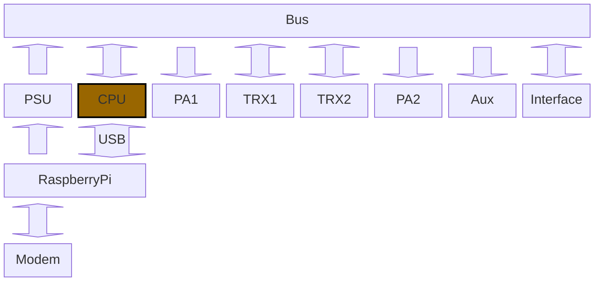

# CPU

Auf dem CPU Module befindet sich der "Kopf" des Funkgerätes. Als erste Idee wird hier ein STM32 verwendet da dieser viele Ein- und Ausgänge bereitstellt. Er besitzt mehrere sehr gute ADCs und DACs welche perfekt für Audio-Verarbeitungen verwendet werden können. Mehrere Hardware-UARTs können als Kommunikation zu den FM Modulen verwendet werden.

Als zusätzliches Interface nach außen hat er zwei Pins welches für einen USB-Port verwendet werden kann. Auf diesem Interface können mehrere HID-Devices (UART, Soundkarte) in Software "angehängt" werden.

## Interfaces

Welche Interfaces werden nun benötigt:

- USB: 1
  - Kommunikation mit dem PC
- UART: 2
  - für TRX1
  - für TRX2
- ADC: 3
  - von TRX1
  - von TRX2
  - von Interface PCB
- DAC: 3
  - zu TRX1
  - zu TRX2
  - zu Interface PCB
- I2C: 6 wobei mehrere Interface zusammengefasst werden können
  - TRX1
  - TRX2
  - PA1
  - PA2
  - AUX
  - Interface PCB
