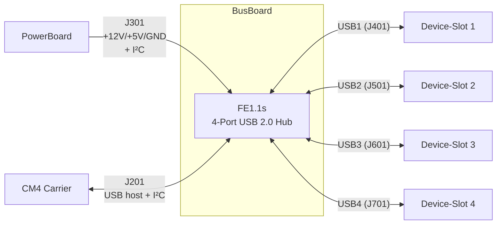

# Bus PCB

<table>
  <tr><th>Top</th><th>Bottom</th></tr>
  <tr>
    <td></td>
    <td></td>
  </tr>
</table>

## Übersicht

Die `Bus`-Platine ist die Backplane der Remote Station. Sie nimmt +12V/+5V/GND vom [PowerBoard](../HW-Module-PowerBoard/), führt die I²C-Verbindung vom [CM4 Carrier](../HW-Module-CM4Carrier/) zum PowerBoard, und stellt vier Modul-Slots zur Verfügung. Auf der Rückseite sitzt ein FE1.1s 4-Port-USB-2.0-Hub: er nimmt einen einzelnen USB-Host-Anschluss vom CM4 entgegen und stellt jedem der vier Slots einen eigenen USB-Downstream-Port zur Verfügung. Jeder USB-Port (CM4-Upstream + 4 Downstream zu den Slots) ist mit einem USBLC6-2SC6 ESD-geschützt.

## Block-Diagramm

I²C ist **nicht** zu den Device-Slots durchgeführt — der Bus existiert physisch nur zwischen CM4-Carrier (`J201`) und PowerBoard (`J301`).

## Steckverbinder

Alle 6 Konnektoren sind **Hirose PCN10-20P-2.54DSA** (20 Pin, 2x10, 2.54 mm Raster, Stiftleiste auf der Backplane). Gegenstück auf den Modulen: PCN10-Buchse passender Variante.

| Bezeichner | Rolle              | Pin a2/a3 (I²C) | Pin a5/b5 (USB±) |
| ---------- | ------------------ | --------------- | ---------------- |
| `J201`     | CM4/RPI Connector  | I²C SCL / SDA   | USB-Host vom CM4 |
| `J301`     | Power Connector    | I²C SCL / SDA   | NC               |
| `J401`     | Device Slot 1      | NC              | USB1 (Hub-Port 1) |
| `J501`     | Device Slot 2      | NC              | USB2 (Hub-Port 2) |
| `J601`     | Device Slot 3      | NC              | USB3 (Hub-Port 3) |
| `J701`     | Device Slot 4      | NC              | USB4 (Hub-Port 4) |

USB-Hub-Mapping: USB1→Slot1, USB2→Slot2, USB3→Slot3, USB4→Slot4 (in Reihenfolge der FE1.1s-Ports).

## Pin-Belegung (Power identisch, Signale rollenspezifisch)

Power- und GND-Pins sind auf allen 6 Konnektoren physisch identisch verschaltet. Signal-Pins (I²C, USB) sind je nach Konnektor-Rolle unterschiedlich belegt — siehe vorige Tabelle. Die folgende Pin-Map zeigt die *Position* der Signale; ob diese Pins angeschlossen sind, hängt vom konkreten Konnektor ab.

| Pin | Net | Pin | Net |
|----:|-----|----:|-----|
| a1  | GND          | b1  | GND          |
| a2  | I²C SCL ¹    | b2  | NC           |
| a3  | I²C SDA ¹    | b3  | NC           |
| a4  | NC           | b4  | NC           |
| a5  | USB D+ ²     | b5  | USB D- ²     |
| a6  | +5V          | b6  | +5V          |
| a7  | +5V          | b7  | +5V          |
| a8  | GND          | b8  | GND          |
| a9  | +12V         | b9  | +12V         |
| a10 | +12V         | b10 | +12V         |

¹ **I²C nur auf `J201` (CM4) und `J301` (Power)** — auf den 4 Device-Slots sind die I²C-Pins (a2, a3) **nicht** angeschlossen.
² **USB D+/D-** sind auf `J201` (Upstream vom CM4) und auf `J401`–`J701` (Downstream je Slot) belegt; auf `J301` (Power) sind diese Pins NC.

Verteilung der Versorgung: **4× GND**, **4× +5V**, **4× +12V** über die 20 Pins — bewusst redundant verteilt zur Senkung des Kontaktwiderstands und für höhere Stromtragfähigkeit pro Pin.

## Komponenten

| Bauteil | Funktion |
| ------- | -------- |
| **FE1.1s** | 4-Port USB-2.0-Hub-Controller. Selbst-powered durch +5V vom Bus. Nimmt USB-Upstream von `J201` (CM4 USB-Host) entgegen, stellt USB1–USB4 zur Verfügung. |
| **USBLC6-2SC6** (5×) | TVS-Diode mit ESD-Schutz für USB-Datenleitungen. Eine Instanz pro USB-Port: 1× auf `J201` (Upstream), 4× auf `J401`–`J701` (Downstream je Slot). |
| **Crystal** | Taktquelle für den FE1.1s. |

Hinweis: Das FE1.1s erzeugt seine internen Rails (VD18 ≈ 1.8 V, VD33 ≈ 3.3 V) selbst aus +5V und führt sie *nicht* an den Bus.

## Bestückung

Keine Hand-Löt-Schritte bekannt — Standard JLCPCB-Bestückung deckt FE1.1s, USBLC6, Crystal und alle Konnektoren ab.

## Bringup

Nach Bestückung und mit PowerBoard + CM4 angesteckt (Slots leer):

1. **Power-Sanity:** an einem freien Device-Slot zwischen `a6` und `a1` messen → +5V; zwischen `a9` und `a1` → +12V (= PowerBoard-Eingang). Auf allen 4 Device-Slots identisch.
2. **USB-Enumeration:** vom CM4 `lsusb` ausführen → ein "FE1.1s Hub" (Vendor 1a40:0101 oder ähnlich) muss sichtbar sein. Wenn ja, USB-Upstream + Hub funktionieren.
3. **I²C-Sanity:** vom CM4 `i2cdetect -y 1` ausführen → die zwei INA226-Adressen des PowerBoards (`0x40`, `0x41`) müssen ACKen.

## Verwandte Module

- [PowerBoard](../HW-Module-PowerBoard/) — speist +5V/+12V auf `J301` ein und sitzt mit den beiden INA226 auf dem I²C.
- [CM4 Carrier](../HW-Module-CM4Carrier/) — liefert USB-Host und I²C-Master auf `J201`.

## Daten

- [Schaltplan](BusBoard-schematic.pdf)
- [BOM](BusBoard-bom.html)
- [iBOM](BusBoard-ibom.html)
- [JLCPCB fabrication & stencil](JLCPCB/BusBoard-_JLCPCB_compress.zip)
- [JLCPCB Bom](JLCPCB/BusBoard_bom_jlc.csv)
- [JLCPCB Pick&Place](JLCPCB/BusBoard_cpl_jlc.csv)
