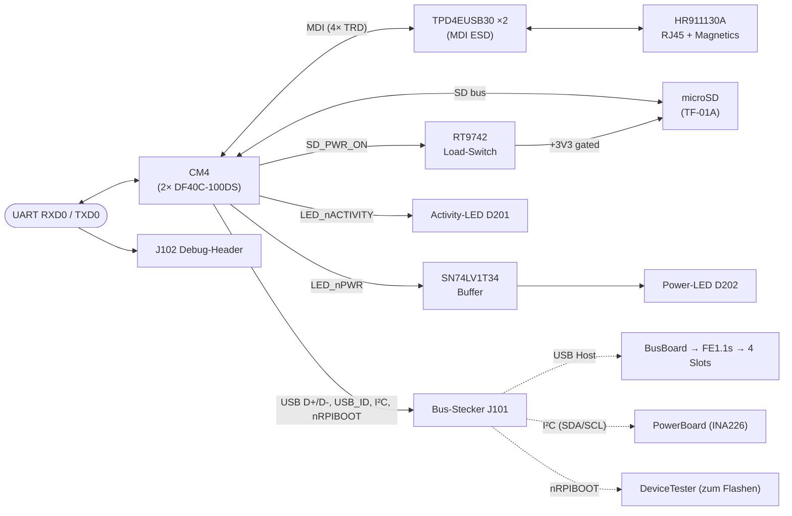

# CM4 Carrier PCB

<table>
  <tr><th>Top</th><th>Bottom</th></tr>
  <tr>
    <td></td>
    <td></td>
  </tr>
</table>

## Übersicht

Trägerplatine für das Raspberry Pi Compute Module 4 (CM4). Das CM4 steckt über zwei 100-Pin Hirose-DF40C-Connectoren auf dem Carrier und bringt CPU, RAM, optional eMMC sowie Schnittstellen (Ethernet, USB, I²C, UART, GPIO) mit. Der Carrier macht die genutzten Schnittstellen physisch zugänglich:

- **Ethernet** (Gigabit) — RJ45 mit integrierten Magnetics (HR911130A) für LAN-Anbindung.
- **microSD** — Boot-Medium für *eMMC-less* CM4-Varianten („lite") sowie Test-/Entwicklungs-Builds.
- **USB-Host** — über den Bus-Stecker zum [BusBoard](../HW-Module-BusBoard/) → FE1.1s-Hub → 4 Modul-Slots.
- **I²C** — über den Bus-Stecker zum [PowerBoard](../HW-Module-PowerBoard/) (Lesen der INA226-Messwerte).
- **UART-Debug** — 3-Pin-Header `J102` direkt für seriellen Konsolen-Zugriff (siehe „Debug-Header" unten).
- **rpiboot** — Flash-Pin (`nRPIBOOT`) ist auf den Bus-Stecker geführt; wird im [DeviceTester](../HW-Module-DeviceTester/) per **manuell gesetztem Jumper** am 4-Pin Flash-Header (`J202`) auf GND gezogen, um den CM4 in den Flash-Modus zu versetzen.

## Block-Diagramm

## CM4-Varianten-Kompatibilität

| Variante | Unterstützt | Zweck |
| -------- | :---------: | ----- |
| eMMC (alle RAM-Größen) | ✅ | **Produktiv-Betrieb** — Boot vom internen eMMC |
| eMMC-less / „lite" (alle RAM-Größen) | ✅ | **Test/Entwicklung** — Boot von microSD |
| Wifi-Variante | ❌ | nicht vorgesehen — keine Antennen-Anbindung auf dem Carrier |

Auf diesem Carrier ist **kein Mix-and-Match** möglich — das jeweils andere Boot-Medium ist hardware-seitig nicht erreichbar:

- eMMC-Varianten booten **immer** vom eMMC. Der CM4 verbindet seinen MMC1-Bus intern fest mit dem eMMC; der externe microSD-Slot dieses Carriers ist physisch nicht angeschlossen.
- lite-Varianten booten **immer** vom microSD-Slot. Hier ist MMC1 auf den externen SD-Pfad geführt; ein eMMC ist nicht bestückt.

Die `rpi-eeprom-config`-Boot-Order ist zwar grundsätzlich auf CM4-Ebene konfigurierbar — auf diesem Carrier hat sie aber keinen Effekt, weil das alternative Boot-Medium physisch nicht erreichbar ist.

## Steckverbinder

| Bezeichner | Typ | Funktion |
| ---------- | --- | -------- |
| **J101** | 20-Pin (Hirose **PCN10C-20S-2.54DS** — weibliche Buchse, paart mit dem PCN10-20P-Stift-Header auf dem BusBoard) | Bus-Anschluss zum [BusBoard](../HW-Module-BusBoard/). Versorgung (+5V/+12V/GND), USB-Host, I²C, USB_ID, nRPIBOOT. |
| **J102** | 3-Pin Header (2.54 mm Raster) | UART-Debug. Pin 1 = `GND`, Pin 2 = `RXD0`, Pin 3 = `TXD0`. *Pin-1-Lage im Silkscreen noch nicht markiert — siehe [Issue #3](https://github.com/OE5XRX/HW-Module-CM4Carrier/issues/3).* |
| **J201, J202** | 2× DF40C-100DS-0.4V_51_ | CM4-Footprint (Board-to-Board, 0.4 mm Raster, 100 Pin pro Stecker). |
| **J301** | HR911130A RJ45 | Gigabit Ethernet inkl. Magnetics + Link/Activity-LEDs. |

### Bus-Stecker `J101` — Lokale Pin-Numerierung

Achtung: Die Pin-Numerierung auf dem Carrier ist **gespiegelt** ggü. der Bus-Seite (BusBoard's `J201` Pin a1 mated mit CM4Carrier's `J101` Pin a10 etc.). Physikalisch passt's; die Signale stimmen überein. Für die *kanonische* Bus-Pinbelegung siehe [BusBoard](../HW-Module-BusBoard/#pin-belegung-20-pin-identisch-auf-allen-konnektoren).

Carrier-eigene Sicht auf `J101`:

| Pin | Net | Pin | Net |
|----:|-----|----:|-----|
| a1  | +12V | b1  | +12V |
| a2  | +12V | b2  | +12V |
| a3  | GND  | b3  | GND  |
| a4  | +5V  | b4  | +5V  |
| a5  | +5V  | b5  | +5V  |
| a6  | USB D+ | b6 | USB D- |
| a7  | NC   | b7  | NC   |
| a8  | I²C SDA | b8 | USB_ID |
| a9  | I²C SCL | b9 | nRPIBOOT |
| a10 | GND  | b10 | GND  |

## Auf dem Carrier verbaute Komponenten

| Bauteil | Funktion |
| ------- | -------- |
| **RT9742GGJ5** (U401) | Load-Switch / Strombegrenzer. Steuert die Versorgung der microSD-Karte (Eingang `SD_PWR_ON` vom CM4 → Ausgang gefilterte +3V3 zur SD-Karte). Erlaubt SD-Power-Cycle vom CM4. |
| **SN74LV1T34DBV** (U201) | Single-Buffer / Level-Shifter (3.3 V). Treibt die Power-LED aus dem CM4-Signal `LED_nPWR` heraus — entkoppelt von schwachen CM4-Boot-Pin-Treibstärken. |
| **2× TPD4EUSB30** (U301, U302) | ESD-Schutz für die vier **Ethernet-MDI-Differential-Paare** (`ETH_TRD0/1/2/3_P/N`) zwischen CM4-PHY und RJ45-Magnetics. Trotz des „USB30"-Namens ein generischer 4-Kanal-TVS, hier auf den Ethernet-Linien verschaltet. |
| **D201 (Activity-LED)** | Direkt vom CM4-Pin `LED_nACTIVITY` via Vorwiderstand (R201). Blinkt bei eMMC- oder SD-I/O. |
| **D202 (Power-LED)** | Über den SN74LV1T34-Buffer vom CM4-Pin `LED_nPWR`. Leuchtet sobald der CM4 läuft. |

Hinweis: Der Carrier hat **keine eigenen I²C-Slaves**. Der I²C-Bus wird unverändert zwischen CM4 und BusBoard durchgereicht; die einzigen I²C-Devices in der Remote Station sind die zwei INA226 auf dem [PowerBoard](../HW-Module-PowerBoard/) (`0x40` und `0x41`).

## Versorgung

| Rail | Quelle | Verbrauch |
| ---- | ------ | --------- |
| +5V  | Bus-Stecker (vom [PowerBoard](../HW-Module-PowerBoard/)) | < 1 A typ. (kein HDMI angeschlossen) |
| +3V3 | CM4-intern (am DF40C verfügbar) | für lokale Logik: SN74LV1T34, RT9742, RJ45-LEDs |
| +12V | Bus durchgeschleift | nicht direkt vom Carrier genutzt |

## Debug-Header (J102)

3-Pin-Stiftleiste, 2.54 mm Raster:

| Pin | Signal | Beschreibung |
|----:|--------|--------------|
| 1 | `GND` | Masse-Referenz |
| 2 | `RXD0` | UART RX vom CM4 (PC sendet hier hinein) |
| 3 | `TXD0` | UART TX vom CM4 (PC empfängt hier) |

**Pin-1-Lage im Silkscreen ist auf der aktuellen Revision NICHT markiert** ([Issue #3](https://github.com/OE5XRX/HW-Module-CM4Carrier/issues/3)) — Schaltplan zu Rate ziehen oder die Adapter-Pinbelegung kurz mit einem Multimeter gegen GND verifizieren bevor angeschlossen wird.

Standard UART-Parameter des CM4-Bootloaders + Raspberry Pi OS: **115200 8N1** (sofern in `config.txt` / `cmdline.txt` nicht überschrieben).

## rpiboot-Workflow (CM4 flashen)

Der CM4-Carrier hat **keinen eigenen rpiboot-Jumper**. Stattdessen sind die zwei dafür nötigen Pins (`nRPIBOOT` und `USB_OTG_ID`) auf den Bus-Stecker geführt (`J101 b9` und `J101 b8`). Auf dem [DeviceTester](../HW-Module-DeviceTester/) werden sie über den 4-Pin Flash-Header `J202` **manuell** per Jumper gesetzt — beide Pins nebeneinander mit jeweils GND bzw. +5V als Nachbar:

- **`nRPIBOOT` → GND** (Pin 2 ↔ Pin 1): versetzt den CM4 nach Power-Up in den USB-Boot-Modus statt vom eMMC zu booten.
- **`USB_OTG_ID` → +5V** (Pin 3 ↔ Pin 4): schaltet die USB-Schnittstelle in den Device-Mode (CM4 als USB-Gerät, PC als Host).

Ablauf:

1. CM4 in den Carrier einsetzen, Carrier in den DeviceTester (Bus-Stecker `J101` ↔ DeviceTester `J203`) einsetzen.
2. Auf dem DeviceTester am 4-Pin-Header `J202` **beide** Jumper setzen — Pin 1↔2 (nRPIBOOT auf GND) und Pin 3↔4 (USB_OTG_ID auf +5V).
3. DeviceTester per USB-C mit dem PC verbinden (`J201`).
4. `rpiboot` auf dem PC starten — der CM4 erscheint als USB-Mass-Storage-Device (eMMC-Variante) bzw. erlaubt einen direkten Image-Schreib-Vorgang.
5. Nach Abschluss: Jumper am DeviceTester wieder abziehen, sonst bootet der Carrier beim nächsten Power-Up wieder in den rpiboot-Mode statt regulär.

⚠️ **Funktioniert nur mit der eMMC-Variante** des CM4 — eMMC-less / lite-CM4s booten ohnehin von SD und brauchen keinen Flash-Schritt; einfach SD-Karte mit dem Image bestücken.

## Bringup

Nach Bestückung und mit eingesetztem CM4:

1. **Optisch:** Power-LED `D202` muss kurz nach Anlegen von +5V leuchten. Wenn nicht: prüfen ob CM4 korrekt sitzt und der eMMC-Variantenwahl entspricht (lite-Variante ohne SD-Karte hat nichts zum Booten).
2. **Activity-LED:** `D201` blinkt unregelmäßig sobald der CM4 mit dem eMMC/SD redet.
3. **Ethernet:** RJ45 einstecken — beide LEDs am Stecker (Link gelb, Activity grün) sollten passend zur Netzwerklage aufleuchten.
4. **UART-Konsole:** USB-TTL-Adapter (3.3 V Level!) an `J102` (GND/RX/TX) anschließen, 115200 8N1 → CM4-Bootloader + Linux-Boot sichtbar.
5. **I²C-Sanity:** vom CM4 `i2cdetect -y 1` ausführen → die zwei INA226-Adressen `0x40` und `0x41` aus dem PowerBoard müssen ACK geben.

## Verwandte Module

- [BusBoard](../HW-Module-BusBoard/) — nimmt den USB-Host des CM4 entgegen und verteilt ihn als 4-Port-Hub auf die Modulslots.
- [PowerBoard](../HW-Module-PowerBoard/) — speist +5V/+12V via Bus ein; INA226 werden vom CM4 per I²C ausgelesen.
- [DeviceTester](../HW-Module-DeviceTester/) — zieht `nRPIBOOT` für rpiboot-Mode auf GND und stellt USB-C zum Flash-PC bereit.

## Daten

- [Schaltplan](CM4Carrier-schematic.pdf)
- [BOM](CM4Carrier-bom.html)
- [iBOM](CM4Carrier-ibom.html)
- [JLCPCB fabrication & stencil](JLCPCB/CM4Carrier-_JLCPCB_compress.zip)
- [JLCPCB Bom](JLCPCB/CM4Carrier_bom_jlc.csv)
- [JLCPCB Pick&Place](JLCPCB/CM4Carrier_cpl_jlc.csv)
