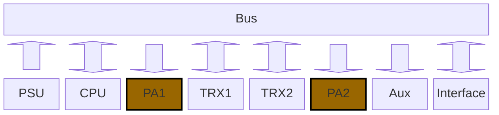

# PA

```mermaid
block-beta
columns 8
Bus:8
blockArrowId1<["&nbsp;&nbsp;&nbsp;"]>(up)
blockArrowId2<["&nbsp;&nbsp;&nbsp;"]>(updown)
blockArrowId3<["&nbsp;&nbsp;&nbsp;"]>(down)
blockArrowId4<["&nbsp;&nbsp;&nbsp;"]>(updown)
blockArrowId5<["&nbsp;&nbsp;&nbsp;"]>(updown)
blockArrowId6<["&nbsp;&nbsp;&nbsp;"]>(down)
blockArrowId7<["&nbsp;&nbsp;&nbsp;"]>(down)
blockArrowId8<["&nbsp;&nbsp;&nbsp;"]>(updown)
PSU
CPU
PA1
TRX1
TRX2
PA2
Aux
Interface
style PA1 fill:#960,stroke:#000,stroke-width:2px
style PA2 fill:#960,stroke:#000,stroke-width:2px
```
