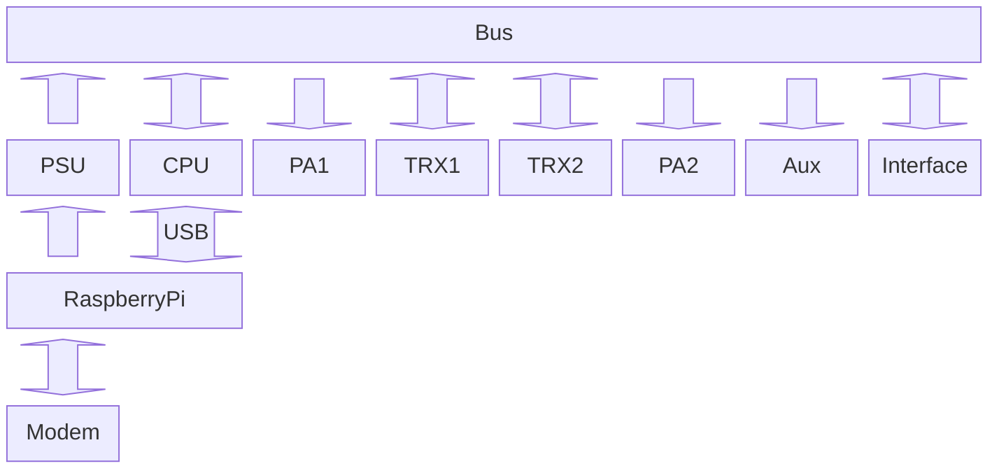

# Hardware

Aktuell sind wir noch auf der Suche nach einer guten und günstigen Hardware Lösung.

## Teure Funkgeräte

Von einer Verwendung von Funkgeräten, die zwar Remote Betrieb eingebaut haben, jedoch sehr teuer sind, sehen wir ab. Denn wer will schon mehrere hunderte  Euro's im Baum weit entfernt aufhängen?

## China "Billig"funkgeräte

Günstige Hand-Funkgeräte aus China können schon sehr viel, sind einfach in der Um-Programmierung und hätten eine bereits fertige Hardware. Jedoch kann hier meist nicht gleichzeitig Daten sowie auch Audio mit einem PC ausgetauscht werden.

## Selbstbau

Als letzte Möglichkeit bleibt nur der Selbstbau auf Basis von FM Modulen wie das SA818U/V.
Hier wäre ein modularer Aufbau empfehlenswert der ein leichtes austauschen der defekten Module erleichtert.
Durch eine Bus-Platine im hinteren Bereich des Gehäuses wäre die Kommunikation der einzelnen Platinen gewährleistet.
So ähnliche Systeme wurden früher in 19-Zoll Systeme eingebaut für kompliziertere Projekte.

[Hier](https://merath.com/19-zoll-technik) findet man Beispiele für 19-Zoll Systeme.

Für die Steuerung des neu erschaffenen Transceivers könnte ein STM32 verwendet werden. Dieser hat die nötigen Ein- und Ausgänge für die Ansteuerung der FM Module so wie die Möglichkeit USB-Devices zu "simulieren" (UART, Soundcard, etc.).

Mit einer zusätzliche Platine die zb. einen Bildschirm und Anschlüsse für Mikrophone und Lautsprecher bereit halten kann dieses Funkgerät auch als Stations-Funkgerät aufgebaut werden um direkt QSOs zu machen.

Ein Verstärker Module mit einem Mitsubishi RA08H1317M (8W), RA30H1317M1 (30W) oder RA60H1317M (60W) für 2m oder für 70cm ein RA07H4047M (7W), RA30H4047M1 (30W) oder RA55H4047M (55W) runden das Funkgerät ab.

Eine grobe Übersicht der einzelnen Module soll in den nächsten Seiten gegeben werden. Details zu den Modulen kann in den jeweiligen Projekten gefunden werden.

