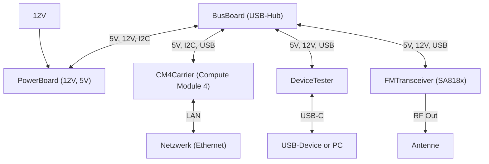

# Hardware

In diesem Kapitel sollen verschiedene Möglichkeiten erörtert werden.

## Teure Funkgeräte

Von einer Verwendung von Funkgeräten, die zwar Remote Betrieb eingebaut haben, jedoch sehr teuer sind, sehen wir ab.
Denn wer will schon mehrere hunderte Euro's im Baum weit entfernt aufhängen?
Auch ist meist der Aufbau dieser Funkgeräte nicht outdoor tauglich.

## China "Billig"funkgeräte

Günstige Hand-Funkgeräte aus China können schon sehr viel, sind einfach in der Um-Programmierung und hätten eine bereits fertige Hardware.
Jedoch kann hier meist nicht gleichzeitig Daten sowie auch Audio mit einem PC ausgetauscht werden.
Weiters sind die Funkgeräte sehr schwer zu steuern bzw. auch nicht wirklich outdoor tauglich.

## Selbstbau

Als letzte Möglichkeit bleibt nur der Selbstbau auf Basis von FM Modulen wie das SA818U/V.
Hier wäre ein modularer Aufbau empfehlenswert der ein leichtes austauschen der defekten Module erleichtert.
Durch eine Bus-Platine im hinteren Bereich des Gehäuses wäre die Kommunikation der einzelnen Platinen gewährleistet.
So ähnliche Systeme wurden früher in 19-Zoll Systeme eingebaut für komplizierter Projekte.

[Hier](https://merath.com/19-zoll-technik) findet man Beispiele für 19-Zoll Systeme.

### Modularer Aufbau

Auf einer Bus Platine ist ein USB-Hub vorgesehen, dieser übernimmt die Kommunikation zwischen den einzelnen Modulen.

Das CM4 Carrier Module beherbergt ein Computer Module 4 (Raspberry Pi 4) und übernimmt die High-Level Aufgaben.

Das Power Board erstellt die Notwendigen Spannungen.

Das Transceivers, so wie alle weiteren Module welche Low-Level Aufgaben übernimmt, beherbergt einen STM32.
Dieser STM32 stellt die Ein- und Ausgänge für verschiedene Aufgaben zur Verfügung.
Das FM Module braucht zb. diese simulierten USB-Devices: UART, Soundkarte, GPIOs.

Eine grobe Übersicht der einzelnen Module soll in den nächsten Seiten gegeben werden.

