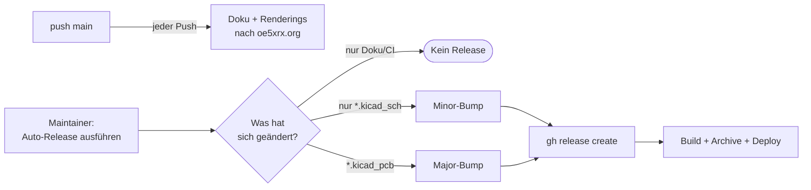

# Versioning & Releases

Wie wir die Hardware-Module ([PowerBoard](./HW-Module-PowerBoard/), [BusBoard](./HW-Module-BusBoard/), [CM4 Carrier](./HW-Module-CM4Carrier/), [FM Transceiver](./HW-Module-FMTransceiver/), [DeviceTester](./HW-Module-DeviceTester/)) versionieren — die Idee in einer Doku-Seite, nicht die Implementierung im Detail.

## Versions-Schema

Jedes Modul nutzt `v<MAJOR>.<MINOR>` — bewusst nur 2 Stellen, kein Patch-Level. Hardware bekommt selten kleine Bugfixes, dafür aber Re-Routes und Komponenten-Tauschs:

| Bump | Auslöser | Beispiel |
| ---- | -------- | -------- |
| **MAJOR** (`v1.x → v2.0`) | `*.kicad_pcb` im Source ändert sich | Re-Routing, neuer Stecker, Pad/Silkscreen-Fix |
| **MINOR** (`v1.0 → v1.1`) | Nur `*.kicad_sch` ändert sich, PCB-Layout bleibt | LDO durch pin-kompatiblen Ersatz |
| **kein Release** | Nur Doku, README, CI | Tippfehler in einer `index.md` |

Faustregel: sobald das PCB ein neues Gerber-File produziert, ist das ein Major. Alles andere ist Minor oder *nur Doku*.

## Wie kommt ein Release zustande?

1. Maintainer pusht seine Änderungen auf `main`. Jeder Push deployed automatisch die Doku samt frischer Renderings unter `oe5xrx.org/docs/remote-station/hardware/<repo>/` — eine Übersicht aller Modul-Pages liegt auf der [Hardware-Seite](../).
2. Will der Maintainer einen echten Release, startet er im Modul-Repo den **Auto-Release-Workflow** (per *Actions* → *Auto-Release* → *Run workflow*). Der schaut sich den Diff seit dem letzten Release an, entscheidet Major/Minor/kein Release nach der Tabelle oben und erstellt den passenden Tag plus Release-Notes.
3. Beim neuen Release läuft KiBot, ein BOM-Sync zu InvenTree, und die fertigen Artefakte ersetzen den bisherigen Live-Stand auf der Webseite.

## Versions-Label am PCB und im Schaltplan

Im KiCad-Titelblock steht der Platzhalter `<<VERSION>>`. CI ersetzt ihn beim Build — **mit unterschiedlichen Werten** je nachdem ob es sich um einen Schaltplan oder das PCB handelt:

- **PCB-Silkscreen** → nur die Major-Version mit `v`-Prefix (`v1`). Die PCB ist innerhalb einer Major-Version baulich identisch — Minor-Bumps tauschen nur Komponenten, das Layout bleibt unverändert. Das Label am Board zeigt also die Hardware-Revision, nicht den momentanen Doku-Stand.
- **Schaltplan-Titelblock** → die volle Versionsnummer ohne `v`-Prefix (`1.5`). Schaltpläne ändern sich pro Minor-Bump; das Rev-Feld muss feiner sein, damit man zwei PDFs unterscheiden kann.

Hat man also ein PCB mit Silkscreen `v1` in der Hand, findet man den passenden Doku-Stand so:

- **Aktueller Major** → kanonische Doku unter `oe5xrx.org/docs/remote-station/hardware/<repo>/`
- **Älterer Major** → archivierte Doku unter `…/<repo>/v1/`, `…/<repo>/v0/` etc.

## Archive-Strategie

Beim Major-Bump (z.B. `v1.x → v2.0`) verschiebt CI den bisherigen `/<repo>/`-Inhalt auf `/<repo>/v1/`. Danach landet der neue v2-Stand im Wurzelverzeichnis. Minor-Bumps und reine Doku-Pushes lassen die Archive in Ruhe.

Konsequenz: die aktuelle Major-Version ist immer einen Klick weniger entfernt; ältere Hardware-Revisionen bleiben aber dauerhaft erreichbar — wichtig, wenn jemand ein *altes* Board aus dem Schrank holt.

## Cross-Repo-Kompatibilität

Jedes Modul versioniert eigenständig. PowerBoard `v1.5` und BusBoard `v2.0` haben keine implizite Kopplung. Falls eine Modul-Version eine andere nicht mehr unterstützt, steht das in der `doc/index.md` des betreffenden Moduls — keine zentrale Compatibility-Matrix, jedes Modul-Doc spricht für sich.

## Firmware ist anders

Die STM32-Firmware im FM-Modul lebt in [`FW-RemoteStation`](https://github.com/OE5XRX/FW-RemoteStation) und nutzt **3-Stellen-Semver** (`v1.2.3`). Firmware kriegt regelmäßig Patches, Hardware nicht — daher die unterschiedlichen Schemas.

## Faustregeln für Maintainer

Was du wann erwarten kannst:

- **Tippfehler in der Doku gefixt** → push, Auto-Deploy, kein Release.
- **Kondensator durch pin-kompatiblen Ersatz getauscht** → Minor.
- **PCB neu geroutet, neue Power-Plane** → Major.
- **Pin-1-Markierung im Silkscreen verschoben** → Major. Auch wenn's optisch wirkt: für die Fertigung ist es ein neuer Gerber-Satz.

Beim allerersten Release legt der Maintainer den Tag `v1.0` selbst per `gh release create v1.0 --generate-notes` an — danach übernimmt der Auto-Release-Workflow. Manuelle Tag-Pushes sind sonst nicht vorgesehen.

## Wo siehst du welche Version?

| Stelle | Was wird gezeigt |
| ------ | ---------------- |
| `oe5xrx.org/docs/remote-station/hardware/<repo>/` | Aktuelle Major-Version |
| `…/<repo>/v1/`, `…/v0/` etc. | Archivierte Major-Versionen |
| `github.com/OE5XRX/<repo>/releases` | Alle Tags + Release-Notes |
| PCB-Titelblock (Silkscreen) | Hardware-Version (`MAJOR.MINOR`, ohne `v`) |
| InvenTree | BOM pro Release-Tag |
