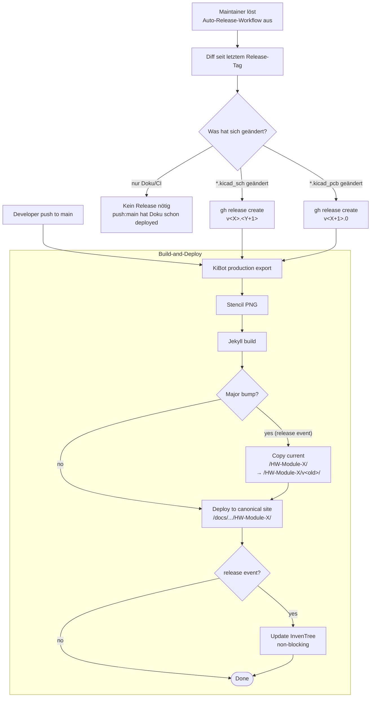

# Versioning & Releases

Diese Seite beschreibt das Versions-Schema, den Release-Workflow und die Archive-Strategie der OE5XRX-Hardware-Module ([PowerBoard](./HW-Module-PowerBoard/), [BusBoard](./HW-Module-BusBoard/), [CM4 Carrier](./HW-Module-CM4Carrier/), [FM Transceiver](./HW-Module-FMTransceiver/), [DeviceTester](./HW-Module-DeviceTester/)).

## Versions-Schema

Jedes Modul verwendet **2-Level Semantic Versioning**: `v<MAJOR>.<MINOR>`. Es gibt **kein PATCH-Level**.

| Bump | Was hat sich geändert | Beispiel |
| ---- | --------------------- | -------- |
| **MAJOR** (`v1.x → v2.0`) | PCB-Layout, Routing, Footprint-Änderung, Stecker-Pinout-Änderung — Hardware ist *nicht* abwärts-kompatibel | Re-Routing-Iteration, neuer Steckertyp |
| **MINOR** (`v1.0 → v1.1`) | Komponenten-Austausch ohne Layout-Änderung, neue Variante, Pad-Korrekturen — BOM ändert sich, PCB-Layout bleibt stabil | LDO durch pin-kompatiblen Ersatztyp ersetzt |
| **kein Tag** (push:main) | Nur Dokumentation, README, Workflows, CI-Konfig — keine `.kicad_*` Änderung | Tippfehler in `doc/index.md`, neue Bringup-Schritte hinzugefügt |

Die Bump-Entscheidung trifft ein **Auto-Release-Workflow** im jeweiligen Modul-Repo (per `workflow_dispatch` ausgelöst): er analysiert die Datei-Änderungen seit dem letzten Release-Tag und ermittelt den passenden Bump automatisch.

## Release-Workflow



### Push auf `main` (Doku-only Patches)

- Trigger: `push: main` Event
- Workflow: KiBot läuft (BOM/Gerbers/Renderings werden frisch erzeugt), `<<VERSION>>`-Platzhalter im PCB-Titelblock wird mit der **letzten Release-Tag-Version** befüllt, Jekyll baut die Doku, alles wird nach `https://oe5xrx.org/docs/remote-station/hardware/<repo>/` deployed.
- **Kein** InvenTree-Update.
- **Kein** Archive.

### Auto-Release-Workflow (`workflow_dispatch`)

- Trigger: Maintainer klickt im Modul-Repo unter „Actions" auf „Auto-Release" → „Run workflow".
- Logik:
  1. Letzter Release-Tag wird ermittelt (`gh release list --limit 1`).
  2. Diff vom letzten Release-Tag bis `HEAD` wird auf Dateien geprüft.
  3. Falls `*.kicad_pcb` geändert → nächster Tag wird **Major-Bump** (`v<X+1>.0`).
  4. Sonst falls `*.kicad_sch` geändert → nächster Tag wird **Minor-Bump** (`v<X>.<Y+1>`).
  5. Sonst → keine Tag-Erstellung (push:main hat die Doku schon deployed).
  6. Bei Tag-Erstellung: `gh release create` mit automatisch generierten Release-Notes.

### Release-Event (`release: published`)

- Trigger: Auto-Release hat einen neuen Tag erzeugt.
- Workflow:
  1. KiBot läuft (Production-Export).
  2. `<<VERSION>>`-Platzhalter im PCB-Titelblock wird mit dem **neuen Release-Tag** befüllt (Tag ohne `v`-Prefix, z.B. `1.5`).
  3. Bei **Major-Bump**: aktuelle `/HW-Module-X/`-Ordner-Inhalte werden auf `/HW-Module-X/v<old-major>/` kopiert (Archive-Snapshot), bevor der neue Stand deployed wird. Existiert die Archive-Pfad bereits, wird das Kopieren übersprungen (Schutz vor versehentlichem Überschreiben).
  4. InvenTree-Update für die neue BOM (non-blocking — falls InvenTree down ist, fehlschlägt nur dieser Step, der Rest geht durch).
  5. Deploy nach `https://oe5xrx.org/docs/remote-station/hardware/<repo>/`.

## PCB-Titelblock-Versions-Injection

Jeder KiCad-Schaltplan enthält den Platzhalter `<<VERSION>>`. Beim Build wird der ersetzt mit einer reinen Semver-Zahl, ohne `v`-Prefix, ohne Git-SHA:

| Trigger | Was wird in `<<VERSION>>` injiziert |
| ------- | ----------------------------------- |
| Tagged Release (`release: published`) | Tag-Name ohne `v`, z.B. `1.5` |
| Push auf `main` (zwischen Releases) | Letzter Release-Tag ohne `v`, z.B. `1.5` |
| Push auf `main` bevor je ein Release gemacht wurde | `pre-release` |

Konsequenz: **das PCB zeigt die Hardware-Version**, nicht den momentanen Doku-Stand. Wenn du ein physisches PCB mit „1.5" gedruckt in der Hand hast, findest du den passenden Modul-Stand zur Hardware-Revision direkt:

- Live-Doku passend zur Major-Version: `https://oe5xrx.org/docs/remote-station/hardware/<repo>/`
- Historische Major-Archive: `https://oe5xrx.org/docs/remote-station/hardware/<repo>/v1/`

## Archive-Strategie

Auf `https://oe5xrx.org/docs/remote-station/hardware/<repo>/`:

```
docs/remote-station/hardware/HW-Module-PowerBoard/
├── (aktueller Major, z.B. v2.x.y)
├── v1/       ← Snapshot des letzten v1.x-Stands (eingefroren als v2.0 released wurde)
└── v0/       ← Snapshot des letzten v0.x-Stands (falls je vorhanden)
```

Regeln:

- Beim **Major-Bump** wird der aktuelle Stand snapshot-kopiert nach `/v<old-major>/`, bevor der neue Stand das Wurzelverzeichnis überschreibt.
- Bei **Minor-Bumps** und **push:main** bleibt nur das Wurzelverzeichnis aktualisiert; vorhandene Archive bleiben unverändert.
- Existiert der Archive-Pfad bereits, wird **nicht** überschrieben (Schutz vor versehentlichem Doppel-Trigger oder Re-Release).

## Manuelle Releases / Tag-Pushes

Manuelle Tag-Pushes durch Maintainer sind **nicht vorgesehen**. Der Auto-Release-Workflow ist die einzige unterstützte Methode. Repository-Settings sollten Tag Protection Rules aktivieren, sodass nur GitHub-Actions (mit entsprechender Identität) Tags pushen können.

Notfall-Korrekturen (z.B. fehlerhaftes Release rollbacken): manuelle Steps wie `gh release delete v2.0` und Wiederherstellung der `/HW-Module-X/`-Inhalte aus `/v1/` per `git` im OE5XRX.github.io-Repo.

## Cross-Repo-Kompatibilität

Die Modul-Versionen sind **unabhängig** voneinander. PowerBoard `v1.5` und BusBoard `v2.0` haben keine implizite Kopplung — jedes Modul versioniert eigenständig.

Falls eine Modul-Version eine andere Modul-Version explizit nicht mehr unterstützt, wird das **in der `doc/index.md` des Moduls** dokumentiert (z.B. „PowerBoard v2.0 erfordert BusBoard ≥ v1.5 wegen erhöhter Strom­leitfähigkeit"). Es gibt keine zentrale Compatibility-Matrix — jedes Modul-Doc spricht für sich.

## Firmware-Versionen

Die STM32-Firmware im FM-Modul wird in einem **eigenen Repo** ([`FW-RemoteStation`](https://github.com/OE5XRX/FW-RemoteStation)) versioniert — ebenfalls Semver, aber **mit 3 Stellen** (`v1.2.3`), weil Firmware Patches anders behandelt als Hardware-Module.

Bei Firmware-Releases die ein bestimmtes Hardware-Modul nicht mehr unterstützen wird das in den FM-Modul-Docs vermerkt (z.B. „FW ≥ v2.0 setzt FM-Modul ≥ v1.5 voraus").

## Operative Hinweise für Maintainer

### Wann was bumpen?

Faustregeln, von der Maschine eh automatisch erkannt aber zur Vorab-Orientierung:

- **Ich möchte nur einen Tippfehler in der Doku fixen.**
  → Push auf `main`. Auto-Deploy. Kein Release.

- **Ich habe einen Kondensatortyp durch einen pin-kompatiblen Alternativ-Hersteller ersetzt.**
  → `*.kicad_sch` ändert sich, `*.kicad_pcb` Layout bleibt. Auto-Release ergibt **Minor**.

- **Ich habe das PCB neu geroutet (nach DRC-Cleanup, neuer Power-Plane).**
  → `*.kicad_pcb` ändert sich. Auto-Release ergibt **Major**.

- **Ich habe einen kosmetischen Silkscreen-Fix (z.B. Pin-1-Markierung) ohne Routing-Änderung gemacht.**
  → `*.kicad_pcb` ändert sich minimal. Auto-Release-Action wird das als **Major** klassifizieren. Wenn das übertrieben ist, kannst du das Release manuell unterdrücken oder auch akzeptieren — Silkscreen-Änderungen erzeugen ja tatsächlich neue Gerber-Files für die Fertigung.

### Erste Releases

Jedes Modul startet mit Tag `v1.0`, unabhängig vom Modul-Stand der davor existierte (frühere Tags bleiben erhalten, werden aber nicht weiter gepflegt). Pro Modul entscheidet der Maintainer wann das erste `v1.0` released wird.

### Auf welcher Seite wird das jeweils sichtbar?

| Stelle | Was wird gezeigt |
| ------ | ---------------- |
| `oe5xrx.org/docs/remote-station/hardware/<repo>/` | Aktuelle Major-Version |
| `oe5xrx.org/docs/remote-station/hardware/<repo>/v1/` etc. | Archivierte Major-Versionen |
| `github.com/OE5XRX/<repo>/releases` | Alle bisherigen Tags + Release-Notes |
| Auf dem physischen PCB (Titelblock) | Hardware-Version (Major.Minor, ohne v) |
| InvenTree | BOM pro Release-Tag |
