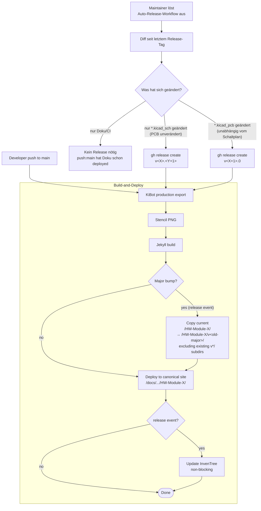

# Versioning & Releases

Diese Seite beschreibt das Versions-Schema, den Release-Workflow und die Archive-Strategie der OE5XRX-Hardware-Module ([PowerBoard](./HW-Module-PowerBoard/), [BusBoard](./HW-Module-BusBoard/), [CM4 Carrier](./HW-Module-CM4Carrier/), [FM Transceiver](./HW-Module-FMTransceiver/), [DeviceTester](./HW-Module-DeviceTester/)).

> **Status (Mai 2026): Konzept — Implementierung in Arbeit.** Diese Seite dokumentiert das geplante Verhalten. Phase 1 (diese Doku) ist live. Der `<<VERSION>>`-Platzhalter (Phase 2-3) ist in [`HW-Module-CI`](https://github.com/OE5XRX/HW-Module-CI) und den fünf Modul-Repos eingezogen. Der Auto-Release-Workflow (Phase 4-5) und die ersten `v1.0`-Releases (Phase 7) folgen — bis dahin behandelt CI jeden `push: main` als Doku-Update mit injiziertem `pre-release`-Label. Maintainer **nicht** vor Phase 7 ein Tag-Ruleset aktivieren (Phase 6), das blockt sonst den manuellen `v1.0`-Bootstrap.

## Versions-Schema

Jedes Modul verwendet **2-Level Semantic Versioning**: `v<MAJOR>.<MINOR>`. Es gibt **kein PATCH-Level**.

| Bump | Was hat sich geändert | Beispiel |
| ---- | --------------------- | -------- |
| **MAJOR** (`v1.x → v2.0`) | `*.kicad_pcb` ändert sich im Source — egal ob Re-Routing, Footprint-Tausch, Pad-Korrektur, Silkscreen-Fix oder Stecker-Pinout. Sobald sich am PCB ein Byte ändert, wird ein neuer Gerber-Satz fertigbar — also Major. | Re-Routing-Iteration, neuer Steckertyp, Pin-1-Markierung verschoben |
| **MINOR** (`v1.0 → v1.1`) | Komponenten-Austausch ohne PCB-Layout-Änderung — `*.kicad_sch` ändert sich, `*.kicad_pcb` bleibt im Source **byte-identisch**. BOM und Schaltplan dürfen sich ändern. | LDO durch pin-kompatiblen Ersatztyp ersetzt |
| **kein Tag** (push:main) | Nur Dokumentation, README, Workflows, CI-Konfig — keine `*.kicad_pcb`/`*.kicad_sch`-Änderung | Tippfehler in `doc/index.md`, neue Bringup-Schritte hinzugefügt |

Die Bump-Entscheidung trifft ein **Auto-Release-Workflow** im jeweiligen Modul-Repo (per `workflow_dispatch` ausgelöst): er analysiert die Datei-Änderungen seit dem letzten Release-Tag und ermittelt den passenden Bump automatisch.

> **Hinweise zum „Byte-Identisch"-Kriterium:**
>
> - Nur `*.kicad_pcb` und `*.kicad_sch` zählen für die Bump-Entscheidung. Andere KiCad-Projektdateien (`*.kicad_pro`, `*.kicad_prl`, `fp-info-cache`, `sym-lib-table`) werden vom Workflow ignoriert — sie betreffen nur die Entwicklungs-Sicht, nicht das Fertigungspaket.
> - Die `<<VERSION>>`-Substitution durch CI passiert auf den **Build-Output-Files** (kopierte temporäre Files vor KiBot), niemals auf den Sources. Der Source-`.kicad_pcb` im Repo behält immer den Literal `<<VERSION>>`. Das heißt: eine reine Versions-Label-Änderung ändert weder das Source-PCB noch löst sie einen falschen Major-Bump aus.

## Release-Workflow



### Push auf `main` (Doku-Deploy)

- Trigger: `push: main` Event (jeder Push, egal welche Files geändert wurden)
- Workflow: KiBot läuft (BOM/Gerbers/Renderings werden frisch erzeugt), `<<VERSION>>`-Platzhalter im PCB- und/oder Schaltplan-Titelblock wird mit der **letzten Release-Tag-Version** befüllt, Jekyll baut die Doku, alles wird nach `https://oe5xrx.org/docs/remote-station/hardware/<repo>/` deployed.
- **Kein** InvenTree-Update.
- **Kein** Archive-Snapshot.

> **Wichtige Annahme:** Dieser Pfad rebuildet auch dann, wenn der Push eine `*.kicad_*`-Änderung enthält. Die Konvention im Repo ist, dass HW-Änderungen direkt vom Maintainer mit dem Auto-Release-Workflow nachgezogen werden — ansonsten zeigt die Live-Seite kurzzeitig den **neuen** Hardware-Stand mit dem **alten** Versions-Label aus dem Titelblock. Bewusst akzeptiert: für 5 Module mit niedriger Update-Frequenz und einem definierten Maintainer-Personenkreis ist die Reibung eines Release-Gates größer als das Risiko des kurzen Mismatches.

### Auto-Release-Workflow (`workflow_dispatch`)

- Trigger: Maintainer klickt im Modul-Repo unter *Actions* auf *Auto-Release* → *Run workflow*.
- Voraussetzungen:
  - **Branch:** der Workflow erzwingt explizit Checkout von `main` und bricht ab, falls er gegen einen anderen Ref gestartet wird (`workflow_dispatch` erlaubt sonst beliebige Branches via UI).
  - **Token mit Trigger-Berechtigung:** `gh release create` muss das nachgelagerte `release: published` Event tatsächlich auslösen. Der Default `GITHUB_TOKEN` aus dem Workflow tut das **nicht** (GitHub-Sicherheitsfeature gegen Workflow-Schleifen). Der Auto-Release-Workflow nutzt daher ein dediziertes Token (PAT oder GitHub-App-Installation-Token) aus den Org-Secrets.
- Logik:
  1. Letzter Release-Tag wird ermittelt. Der Filter berücksichtigt nur Tags, die **dem Schema `v<MAJOR>.<MINOR>` folgen** *und* **deren MAJOR ≥ 1** ist. Pre-Scheme-Tags wie `v0.9` oder Beta-Tags fallen durch — selbst wenn sie syntaktisch passen, gelten sie als Pre-Baseline. Falls ein Modul bereits Legacy-`v1.x`-Tags von vor dieser Konvention hat, müssen diese vor dem Erst-Bootstrap entweder gelöscht werden (`gh release delete <tag> --cleanup-tag`) oder der Maintainer akzeptiert, dass der Auto-Release-Workflow ab dem höchsten existierenden `v1.x` weiterzählt. *(Für die OE5XRX-Module wurde verifiziert: keine Legacy-`v1.x`-Tags vorhanden.)*
  2. Falls **kein** Release ≥ `v1.0` existiert (Erst-Bootstrap) → Workflow wird abgebrochen mit einem Hinweis. Das erste `v1.0` wird vom Maintainer manuell per `gh release create v1.0 --generate-notes` erzeugt; danach pickt der Auto-Release-Workflow das auf.
  3. Diff vom letzten Release-Tag bis `HEAD` wird auf Dateien geprüft.
  4. Falls `*.kicad_pcb` geändert → nächster Tag wird **Major-Bump** (`v<X+1>.0`).
  5. Sonst falls `*.kicad_sch` geändert → nächster Tag wird **Minor-Bump** (`v<X>.<Y+1>`).
  6. Sonst → keine Tag-Erstellung (push:main hat die Doku schon deployed).
  7. Bei Tag-Erstellung: `gh release create` mit automatisch generierten Release-Notes (über das PAT/App-Token, damit das nachgelagerte Release-Event feuert).

### Release-Event (`release: published`)

- Trigger: jeder neue Release im Modul-Repo — sowohl die vom Auto-Release-Workflow erzeugten Tags **als auch** der manuelle `v1.0`-Bootstrap-Release. Beide Pfade laufen denselben Build-and-Deploy-Code, sodass auch die initiale `v1.0` die dokumentierte Versions-Injection und den Deploy-Pfad erhält.
- Workflow:
  1. KiBot läuft (Production-Export).
  2. `<<VERSION>>`-Platzhalter im PCB- und/oder Schaltplan-Titelblock wird mit dem **neuen Release-Tag** befüllt (Tag ohne `v`-Prefix, z.B. `1.5`).
  3. Bei **Major-Bump**: aktuelle `/HW-Module-X/`-Ordner-Inhalte werden auf `/HW-Module-X/v<old-major>/` kopiert (Archive-Snapshot), bevor der neue Stand deployed wird. Bestehende `v*/`-Archive-Unterordner werden vom Snapshot **ausgeschlossen**, sodass keine verschachtelten Archive (`v2/v1/`) entstehen. Existiert der Archive-Pfad bereits, wird das Kopieren übersprungen (Schutz vor versehentlichem Überschreiben). Das Archive-Script ergänzt zusätzlich `nav_exclude: true` in den kopierten `*.md`-Front-Matter-Headern, damit die archivierten Seiten nicht im Just-the-docs Live-Nav als doppelte Einträge erscheinen — sie bleiben per Deep-Link erreichbar.
  4. Deploy nach `https://oe5xrx.org/docs/remote-station/hardware/<repo>/`.
  5. InvenTree-Update für die neue BOM **läuft als letzter Step und ist non-blocking** — falls InvenTree down ist, schlägt nur dieser Step fehl, der Rest (vor allem der Deploy) ist da schon durch. Reihenfolge bewusst so: ein InvenTree-Outage soll niemals das Release-Deploy blockieren.

## Titelblock-Versions-Injection

Jedes KiCad-Projekt enthält im Titelblock den Platzhalter `<<VERSION>>` — je nach Modul im Schaltplan-Titelblock, im PCB-Titelblock (Silkscreen-Layer) oder in beidem (siehe `git grep '<<VERSION>>'` im jeweiligen Modul-Repo). Beim Build wird der Platzhalter ersetzt:

| Trigger | Was wird in `<<VERSION>>` injiziert |
| ------- | ----------------------------------- |
| Tagged Release (`release: published`) | Tag-Name ohne `v`-Prefix, z.B. `1.5` |
| Push auf `main` (zwischen Releases) | Letzter Release-Tag ohne `v`-Prefix, z.B. `1.5` |
| Push auf `main` bevor je ein Release gemacht wurde | Literal `pre-release` (Ausnahme: nicht semver-konform; markiert nur den Bootstrap-Zustand vor dem ersten `v1.0`) |

Konsequenz: **das PCB zeigt die Hardware-Version**, nicht den momentanen Doku-Stand. Wenn du ein physisches PCB mit `1.5` gedruckt in der Hand hast, findest du den passenden Modul-Stand zur Hardware-Revision so:

- Falls `1.5` zur **aktuell** auf der Webseite veröffentlichten Major-Version (`v1.x`) gehört → kanonische Doku unter `https://oe5xrx.org/docs/remote-station/hardware/<repo>/`.
- Falls `1.5` zu einer **älteren** Major-Version gehört (z.B. live ist v2 oder neuer) → Archiv-Doku unter `https://oe5xrx.org/docs/remote-station/hardware/<repo>/v1/`.

Die kanonische URL zeigt also **immer den aktuellen Major** — historische Hardware findet sich in den `v<old-major>/`-Archiven.

## Archive-Strategie

Auf `https://oe5xrx.org/docs/remote-station/hardware/<repo>/`:

```
docs/remote-station/hardware/HW-Module-PowerBoard/
├── (aktueller Major, z.B. v2.x)
├── v1/       ← Snapshot des letzten v1.x-Stands (eingefroren als v2.0 released wurde)
└── v0/       ← Snapshot des letzten v0.x-Stands (falls je vorhanden)
```

Regeln:

- Beim **Major-Bump** wird der aktuelle Stand snapshot-kopiert nach `/v<old-major>/`, bevor der neue Stand das Wurzelverzeichnis überschreibt. Bestehende `v*/`-Unterordner sind vom Snapshot ausgeschlossen.
- Bei **Minor-Bumps** und **push:main** bleibt nur das Wurzelverzeichnis aktualisiert; vorhandene Archive bleiben unverändert.
- Existiert der Archive-Pfad bereits, wird **nicht** überschrieben (Schutz vor versehentlichem Doppel-Trigger oder Re-Release).

## Manuelle Releases / Tag-Pushes

Manuelle Tag-Pushes durch Maintainer sind **nicht vorgesehen** (außer dem Erst-Bootstrap auf `v1.0`). Der Auto-Release-Workflow ist die einzige unterstützte Methode danach. In den Repository-Settings unter **Rules → Rulesets** sollte ein Tag-Ruleset aktiviert werden, das Tag-Pushes nur für **die konkrete Identität erlaubt, unter der `gh release create` im Auto-Release-Workflow läuft** — also typischerweise der PAT-Owner oder die GitHub-App-Installation, deren Token in den Org-Secrets liegt. Eine generische „GitHub Actions" Allow-Rule reicht nicht, weil der PAT-Push als Identität des PAT-Owners zählt, nicht als Bot. *(GitHub hat die alten Tag-Protection-Rules Ende 2024 durch Rulesets ersetzt.)*

> **Reihenfolge wichtig:** Das Tag-Ruleset **erst nach dem manuellen `v1.0`-Bootstrap** aktivieren (Phase 6 nach Phase 7). Ein vorher aktiviertes Ruleset blockt sonst den Bootstrap-Push selbst. Für etwaige spätere `v1.0`-Bootstraps weiterer Module gilt: vorher das Ruleset temporär deaktivieren oder die eigene Identität in die `Bypass list` aufnehmen.

Notfall-Korrekturen (z.B. fehlerhaftes Release rollbacken) verlaufen manuell:

1. **Voraussetzung:** Maintainer mit Repo-Admin-Rechten. Das Tag-Ruleset blockiert sonst auch maintainer-getriebene Tag-Operationen. Vor dem Rollback entweder das Tag-Ruleset unter *Settings → Rules* temporär deaktivieren, oder die eigene Identität in die `Bypass list` des Rulesets aufnehmen.
2. **Source-Stand bereinigen:** der Commit, der den fehlerhaften Release ausgelöst hat, muss im Modul-Repo auf `main` zurückgenommen werden (`git revert <bad-sha>` und push, oder `git reset --hard <good-sha>` + force-push, je nach Situation). Wird das übersprungen, redeployed der nächste `push: main` denselben Bad State unter dem alten Versions-Label — und ein erneuter Auto-Release-Run würde wieder dieselbe defekte Version produzieren.
3. Release **und** Git-Tag löschen:
    - Falls ein Release-Objekt existiert: `gh release delete v2.0 --cleanup-tag` (das `--cleanup-tag`-Flag entfernt zusätzlich den Git-Tag — ohne den Flag bleibt der Tag bestehen und der Auto-Release-Workflow zählt von ihm aus weiter).
    - Falls **nur** ein raw Git-Tag existiert (z.B. Legacy-`v1.x`-Cleanup vor dem Bootstrap, hier ohne zugehörigen GitHub-Release): `git tag -d v2.0 && git push origin :refs/tags/v2.0`. `gh release delete` schlägt sonst mit „release not found" fehl.
4. **Failed-Archive löschen:** falls beim Major-Bump-Versuch bereits ein `/v<failed-major>/`-Snapshot angelegt wurde, diesen vor dem Restore entfernen — sonst überspringt der nächste Versuch das Archive (Existence-Guard) und das Wurzelverzeichnis bekommt keinen sauberen Vorgänger-Snapshot.
5. **Restore:** Wiederherstellung der `/HW-Module-X/`-Inhalte aus `/v<good-major>/` per `git` im OE5XRX.github.io-Repo. Beim Promoten zurück zur Live-Position das `nav_exclude: true` aus den `*.md`-Front-Matter-Headern entfernen — sonst ist die wiederhergestellte Doku zwar live, aber nicht im Just-the-docs Nav-Tree sichtbar.
6. Tag-Ruleset wieder aktivieren bzw. Bypass entfernen.

## Cross-Repo-Kompatibilität

Die Modul-Versionen sind **unabhängig** voneinander. PowerBoard `v1.5` und BusBoard `v2.0` haben keine implizite Kopplung — jedes Modul versioniert eigenständig.

Falls eine Modul-Version eine andere Modul-Version explizit nicht mehr unterstützt, wird das **in der `doc/index.md` des Moduls** dokumentiert (z.B. *PowerBoard v2.0 erfordert BusBoard ≥ v1.5 wegen erhöhter Stromleitfähigkeit*). Es gibt keine zentrale Compatibility-Matrix — jedes Modul-Doc spricht für sich.

## Firmware-Versionen

Die STM32-Firmware im FM-Modul wird in einem **eigenen Repo** ([`FW-RemoteStation`](https://github.com/OE5XRX/FW-RemoteStation)) versioniert — ebenfalls Semver, aber **mit 3 Stellen** (`v1.2.3`), weil Firmware Patches anders behandelt als Hardware-Module.

Bei Firmware-Releases, die ein bestimmtes Hardware-Modul nicht mehr unterstützen, wird das in den FM-Modul-Docs vermerkt (z.B. *FW ≥ v2.0.0 setzt FM-Modul ≥ v1.5 voraus*).

## Operative Hinweise für Maintainer

### Wann was bumpen?

Faustregeln — der Auto-Release-Workflow erkennt das alles automatisch, sie dienen nur zur Vorab-Orientierung:

- **Ich möchte nur einen Tippfehler in der Doku fixen.**
  → Push auf `main`. Auto-Deploy. Kein Release.

- **Ich habe einen Kondensatortyp durch einen pin-kompatiblen Alternativ-Hersteller ersetzt.**
  → `*.kicad_sch` ändert sich, `*.kicad_pcb` Layout bleibt byte-identisch. Auto-Release ergibt **Minor**.

- **Ich habe das PCB neu geroutet (nach DRC-Cleanup, neuer Power-Plane).**
  → `*.kicad_pcb` ändert sich. Auto-Release ergibt **Major**.

- **Ich habe einen kosmetischen Silkscreen-Fix (z.B. Pin-1-Markierung) gemacht.**
  → `*.kicad_pcb` ändert sich (Silkscreen-Layer ist Teil der Gerber-Daten). Auto-Release ergibt **Major** — und das ist auch richtig so: für die Fertigung ändert sich der Datensatz, der ans PCB-House geht. Lass das Release durch.

### Erste Releases

Jedes Modul startet mit Tag `v1.0`. Pre-Scheme-Tags im `v0.x`- oder Beta-Bereich bleiben im Repo erhalten, werden aber nicht weiter gepflegt — der Auto-Release-Workflow filtert auf `MAJOR ≥ 1` und überspringt sie. Sollte ein Modul **bereits** Legacy-`v1.x`-Tags von vor dieser Konvention haben, gibt es zwei Optionen:

- **(a) Legacy-Tags vor dem Bootstrap löschen.** Wenn zum Tag ein GitHub-Release existiert: `gh release delete <tag> --cleanup-tag`. Wenn es nur einen raw Git-Tag ohne Release-Objekt gibt: `git tag -d <tag> && git push origin :refs/tags/<tag>` — `gh release delete` schlägt sonst mit „release not found" fehl.
- **(b) Den ersten Bootstrap-Tag auf den nächsten freien `v<MAJOR>.<MINOR>`-Slot setzen** und den Auto-Release ab da weiterzählen lassen.

Für die OE5XRX-Module wurde vor Rollout verifiziert, dass keine Legacy-`v1.x`-Tags existieren. Pro Modul entscheidet der Maintainer, wann das erste `v1.0` released wird — und legt diesen ersten Tag manuell an (`gh release create v1.0 --generate-notes`). Das Tag-Ruleset darf zu diesem Zeitpunkt **nicht** aktiv sein, sonst blockt es den Bootstrap-Push (siehe „Manuelle Releases / Tag-Pushes" oben). Nach dem ersten Release übernimmt der Auto-Release-Workflow.

### Auf welcher Seite wird das jeweils sichtbar?

| Stelle | Was wird gezeigt |
| ------ | ---------------- |
| `oe5xrx.org/docs/remote-station/hardware/<repo>/` | Aktuelle Major-Version |
| `oe5xrx.org/docs/remote-station/hardware/<repo>/v1/` etc. | Archivierte Major-Versionen |
| `github.com/OE5XRX/<repo>/releases` | Alle bisherigen Tags + Release-Notes |
| Auf dem physischen PCB (Titelblock) | Hardware-Version (Major.Minor, ohne v) |
| InvenTree | BOM pro Release-Tag |
