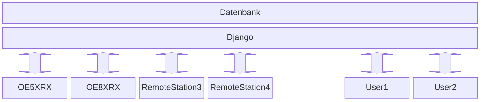

# Software

## Kommunikation

Zur Kommunikation zwischen einem Server und den Remote Stationen wird MQTT verwendet um Befehle auszutauschen. Diese Befehle können verschiedene Daten beinhalten:

- Setzen der RX und/oder TX Frequenz,
- Setzen von CTCSS,
- Setzen der Ausgangsleistung,
- etc.

Zum übertragen von Audio wird vermutlich eine sichere Websocket Verbindung zum Server aufgebaut.

## Server Software

Auf dem Server soll eine Applikation mit dem Framework Django (Python) implementiert werden. Django bietet eine vielzahl von bereits vorgefertigte Elemente zum aufbauen eines Webservers.
Da Django in Python implementiert ist, kann eine einfache Verbindung zu einem MQTT-Broker implementiert werden. Auch Websockets sind bereits integriert.

Die Django-Applikation soll in einem Docker Container laufen. Dies gewährleistet einfaches Testen, so wie schnelle Updates.

## Remote Station's Software

Auf den Remote Stationen soll eine einfache Python Anwendung laufen welches die Kommandos via MQTT erhält und dann entsprechend an die Hardware weiter gibt.
Die Audio Verbindung wird zum Websocket Server aufgebaut wenn sie gebraucht wird.

## Client Software

Dank des Django Frameworks (Webanwendung) braucht auf dem Client nur ein normaler Browser laufen. Die Webanwendung sollte somit auch auf Mobile Geräte verwendbar sein.
